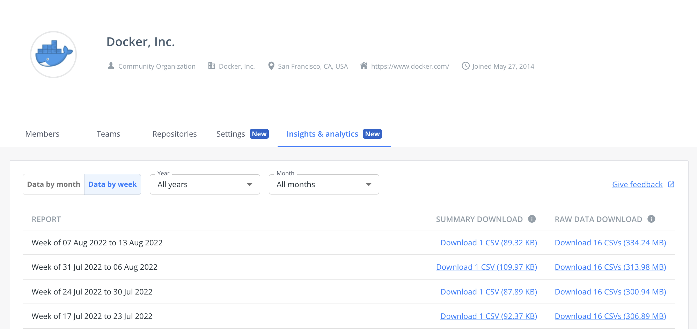

[The Verified Publisher Program](https://hub.docker.com/search?q=&image_filter=store){:target="_blank" rel="noopener" class="_"} provides high-quality images from commercial publishers verified by Docker.

Images part of this program have a special badge on Docker Hub making it easier for you to identify projects that Docker has verified as high-quality commercial publishers.

## For content publishers

The Verified Publisher Program provides several features and benefits to Docker
Hub publishers. The program grants the following perks based on participation tier:

- Verified publisher badge
- Insights and analytics
- Vulnerability scanning
- Additional Docker Business seats
- Removal of rate limiting for developers
- Co-marketing opportunities

### Verified publisher badge

Images part of this program have a badge on Docker Hub making it easier for developers
to identify projects that Docker has verified as high quality publishers and with content they can trust.

## Insights and analytics

The [insights and analytics](/docker-hub/publish/insights-analytics){:
target="blank" rel="noopener" class=""} service provides usage metrics for how
the community uses your Docker images, and grants you insight into your user's
behavior.

You can use the view to select the time span you want to view analytics data and export the data in
either a summary or raw format.

The summary format shows image pulls per tag, and the raw format lists information about every image pull for the
selected time span. Data points include tag, type of pull, user geolocation, client tool (user agent), and more.

### Vulnerability scanning

[Docker Scout](/scout/){:
target="blank" rel="noopener" class=""} provides automatic vulnerability scanning 
for DVP images published to Docker Hub.
Scanning images ensures that the published content is secure, and proves to
developers that they can trust the image.

You can enable scanning on a per-repository
basis, refer to [vulnerability scanning](/docker-hub/vulnerability-scanning/){:
target="blank" rel="noopener" class=""} for more information about how to use
it.

## Who's eligible to become a verified publisher?

Any independent software vendor who distributes software on Docker Hub can join
the Verified Publisher Program. Find out more by heading to the
[Docker Verified Publisher Program](https://www.docker.com/partners/programs){:target="_blank"
rel="noopener" class="_"} page.
