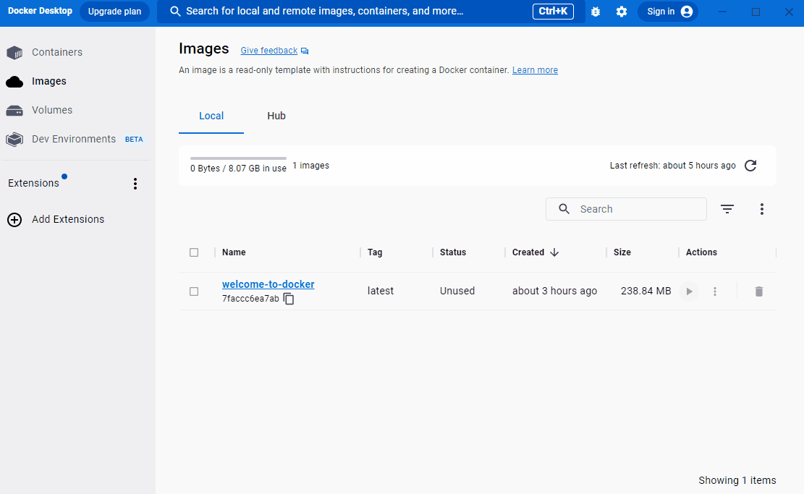

Follow this guide to learn the basic steps of running a container from scratch. This guide uses a sample Node.js application, but it's not necessary to know Node.js.

## Step 1: Get the sample application

If you have git, you can clone the repository for the sample application. Otherwise, you can download the sample application. Choose one of the following options.

   <ul class="nav nav-tabs">
     <li class="active"><a data-toggle="tab" data-target="#git">Clone with git</a></li>
     <li><a data-toggle="tab" data-target="#download">Download</a></li>
   </ul>
  <div class="tab-content">
  <div id="git" class="tab-pane fade in active" markdown="1">

### Clone with git

Use the following command in a terminal to clone the sample application repository.

```console
$ git clone https://github.com/docker/welcome-to-docker
```

   <hr>
  </div>
  <div id="download" class="tab-pane fade" markdown="1">

### Download

If you don't have git, download the source and extract it.

[Download the source](https://github.com/docker/
welcome-to-docker/archive/refs/heads/main.zip){: .button .primary-btn}

   <hr>
  </div>
  </div>

## Step 2: Create a Dockerfile in your project folder

To run your code in a container, the most fundamental thing you need is a Dockerfile. A Dockerfile describes what goes into a container. To add a Dockerfile, create a text file called `Dockerfile` with no file extension in the root directory of your project. You can use the following commands to create a Dockerfile.

   <ul class="nav nav-tabs">
     <li class="active"><a data-toggle="tab" data-target="#mac-linux">Mac / Linux</a></li>
     <li><a data-toggle="tab" data-target="#windows">Windows</a></li>
   </ul>
   <div class="tab-content">
   <div id="mac-linux" class="tab-pane fade in active" markdown="1">

### Mac / Linux

In the terminal, run the following commands listed below.

Change directory to the `welcome-to-docker` directory. Replace `/path/to/welcome-to-docker` with the path to your `welcome-to-docker` directory.
```console
$ cd /path/to/welcome-to-docker
```
Create an empty file named `Dockerfile`.
```console
$ touch Dockerfile
```

   <hr>
   </div>
   <div id="windows" class="tab-pane fade" markdown="1">

### Windows

In the Windows Command Prompt, run the following commands listed below.

Change directory to the `welcome-to-docker` directory. Replace `\path\to\welcome-to-docker` with the path to your `welcome-to-docker` directory.

```console
$ cd \path\to\welcome-to-docker
```
Create an empty file named `Dockerfile`.
```console
$ type nul > Dockerfile
```

   <hr>
   </div>
   </div>

## Step 3: Add instructions to your Dockerfile

Using a text editor or code editor, add the following contents to the Dockerfile:

```dockerfile
# syntax=docker/dockerfile:1

# Start your image with a node base image
FROM node:18-alpine

# Create an application directory
RUN mkdir -p /app

# Set the /app directory as the working directory for any command that follows
WORKDIR /app

# Copy the local app package and package-lock.json file to the container
COPY package*.json ./

# Copy local directories to the working directory of our docker image (/app)
COPY ./src ./src
COPY ./public ./public

# Install node packages, install serve, build the app, and remove dependencies at the end
RUN npm install \
    && npm install -g serve \
    && npm run build \
    && rm -fr node_modules

# Specify that the application in the container listens on port 3000
EXPOSE 3000

# Start the app using serve command
CMD [ "serve", "-s", "build" ]
```

## Step 4: Build your first image

An image is like a static version of a container. You always need an image to run a container. Once you have a Dockerfile in your repository, run the following `docker build` command in the project folder to create an image.

```console
$ docker build -t welcome-to-docker .
```

Building the image may take some time. After your image is built, you can view your image in the **Images** tab in Docker Desktop.

## Step 5: Run your container

To run your image as a container, go to the **Images** tab, and then select **Run** in the **Actions** column of your image. When the **Optional settings** appear, specify the **Host port** number `8089` and then select **Run**.

{:width="500px"}

## Step 6: Verify that your container is running

You can use Docker Desktop to view and access running containers. Go to the **Containers** tab to view your container and select the link in the **Port(s)** column or go to [http://localhost:8089](http://localhost:8089){:target="_blank" rel="noopener" class="_"} to verify that the application is running.

## What's next

In this guide, you built your own image. When running containers on Docker Desktop, you don’t need to build your own image from scratch. You can also run images created by others on Docker Hub.

[Run Docker Hub images](./run-docker-hub-images.md){: .button .primary-btn}

## Dive deeper

### Language-specific guides

If you want to learn more about creating images for applications in other languages, check out the following language-specific guides:
 - [Node.js](../language/nodejs/index.md)
 - [Python](../language/python/index.md)
 - [Go](../language/golang/index.md)
 - [Java](../language/java/index.md)
 - [C# (.NET)](../language/dotnet/index.md)

### Breaking down the `docker build` command

When you built the image, you used the `docker build` command. Here are what the different parts of the `docker build` command do:
 - `docker build`: This command builds the image. It needs one argument, the source folder for the Dockerfile that needs to be built. In this case, it’s the Dockerfile in the current folder, `.`.
 - `-t welcome-to-docker`: The `-t` flag tags the image with a unique name. In this case, `welcome-to-docker`.