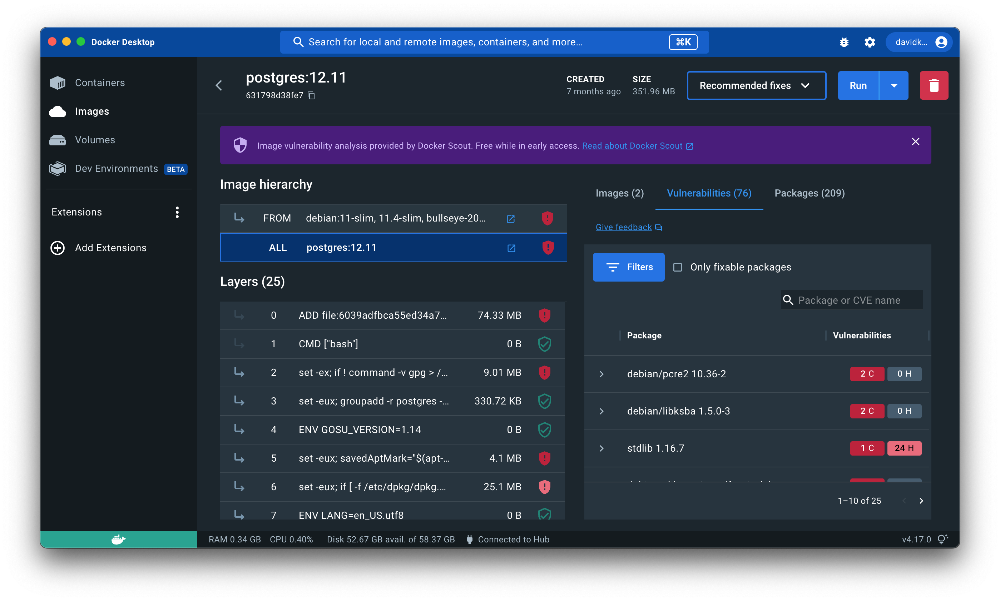

> **Note**
>
> Docker Scout is an [early access](../release-lifecycle.md#early-access-ea)
> product, and requires a Pro, Team, or Business subscription.

The image details view shows a breakdown of the Docker Scout analysis. You can
access the image view both from within Docker Desktop, and from the image tag
page on Docker Hub. This view provides a breakdown of the image hierarchy (base
images), image layers, packages, and vulnerabilities.

The image view lets you inspect the composition of an image from different
perspectives. The view displays vulnerabilities and packages that an image
contains. You can choose whether you want to see data for the image as a whole,
or for a specific base image or layer.

{:width="700px"}

## Image Hierarchy

The image you inspect may have one or more base images listed under **Image
hierarchy**. This means the author of the image used another image as a starting
point when building the image. Often these base images are either operating
system images such as Debian, Ubuntu, and Alpine, or programming language images
such as PHP, Python, and Java.

A base image may have its own parent base image so there is a chain of base
images represented in **Image hierarchy**. Selecting each image in the chain
lets you see which layers originate from each base image. Selecting the **ALL**
row reselects all the layers and base images for the entire image.

One or more of the base images may have updates available, which may include
updated security patches that remove vulnerabilities from your image. Any base
images with available updates are noted to the right of **Image hierarchy**.

## Layers

A Docker image consists of layers. Image layers are listed from top to bottom,
with the earliest layer at the top and the most recent layer at the bottom.
Often, the layers at the top of the list originate from a base image, and the
layers towards the bottom are layers added by the image author, often by adding
commands to a Dockerfile. To see which layers originate from a base image,
simply select a base image under **Image hierarchy** and the relevant layers are
highlighted.

Selecting individual or multiple layers filters the packages and vulnerabilities
on the right-hand side to see what has been added by the selected layers.

## Vulnerabilities

Images may be exposed to vulnerabilities and exploits. These are detected and
listed on the right-hand side, grouped by package, and sorted in order of
severity. Further information on whether the vulnerability has an available fix,
for example, can be examined by expanding the sections.
